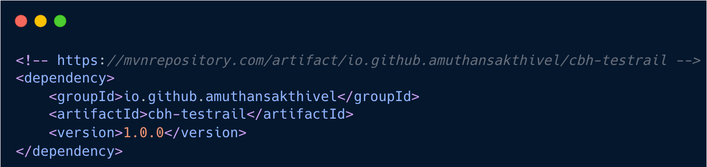
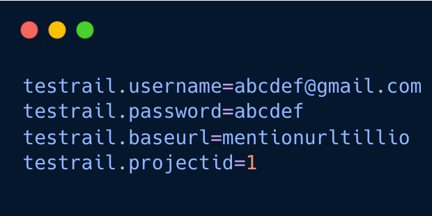
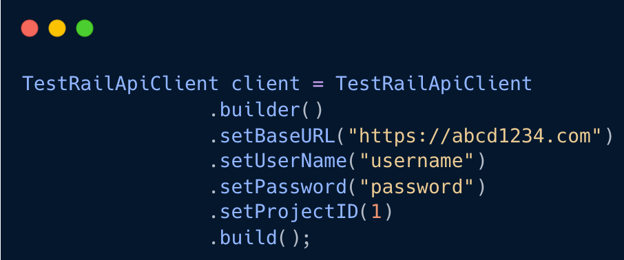
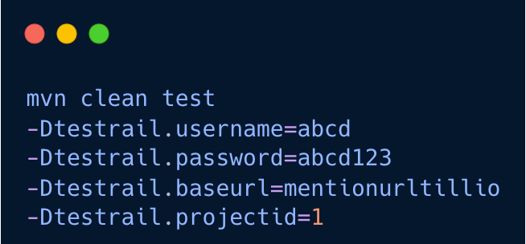
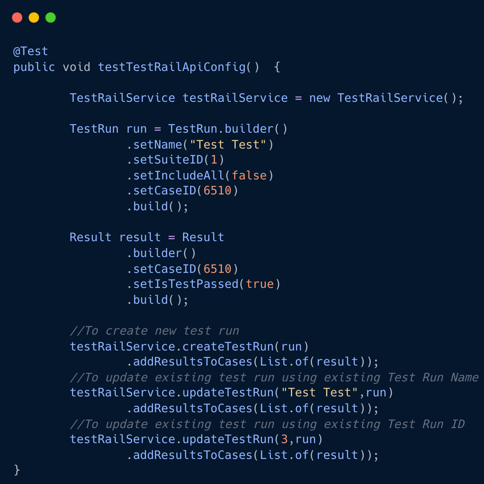
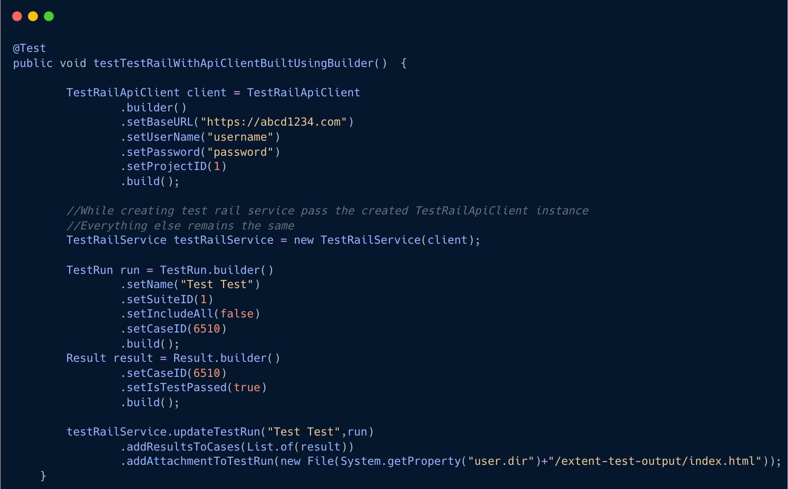
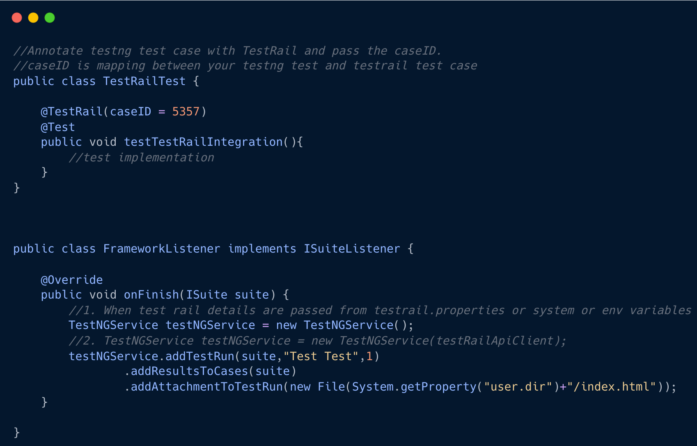

**Java Test Rail API Client**

This project contains easy to use code to integrate the Java Test Automation project to the Test Rail

**How to use this library?**

1. Add the dependencies to the project
   
2. Create a Test Rail Api Client

_Usage 1 : Defining your testrail information in property file_ 

1. Add a testrail.properties to your project's resources folder(src/test/resources or src/main/resources)
2. Define all the meta information about your testrail.
       

_Usage 2 : Creating an instance of Test Rail Api Client using Builder pattern_

_Usage 3 : Passing it as system or environment variables_

3. Create an instance for TestRailService and call appropriate methods.

**Simple Code Snippets** 

1. When TestRailApiClient is handled via properties file

2. When TestRailApiClient is built via builder pattern

3. When we were using this api client in TestNG based frameworks it will be very easy to plug and use.

Note : TestNGService class have overloaded constructor to pass the TestRailApiClient instance

